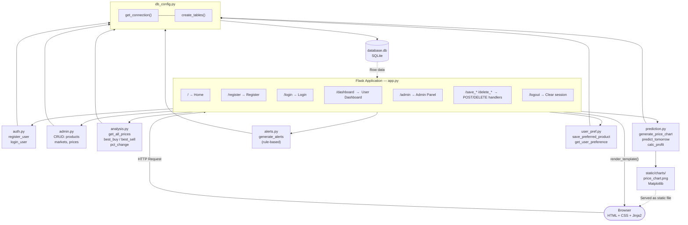
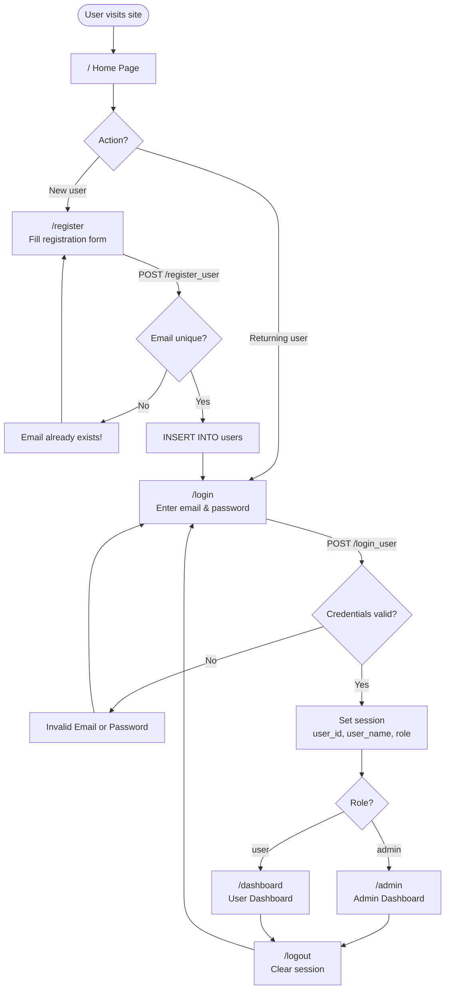
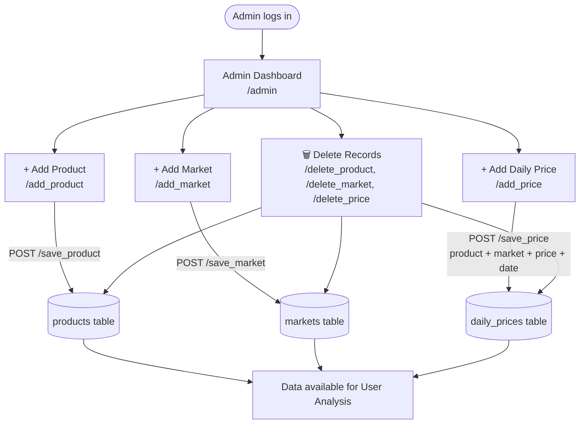
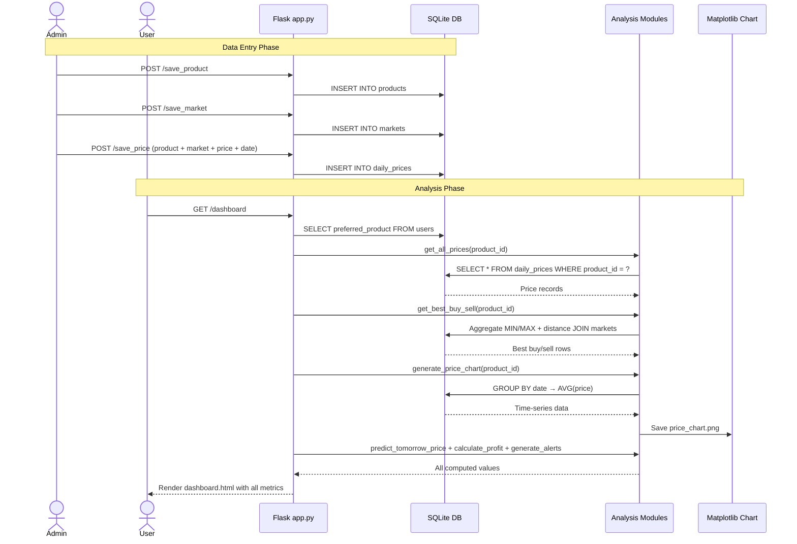
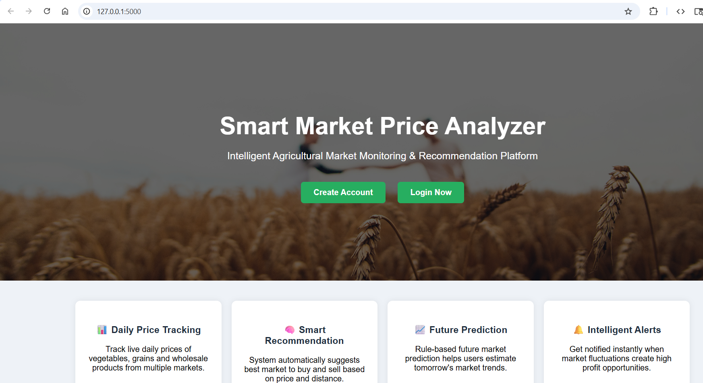
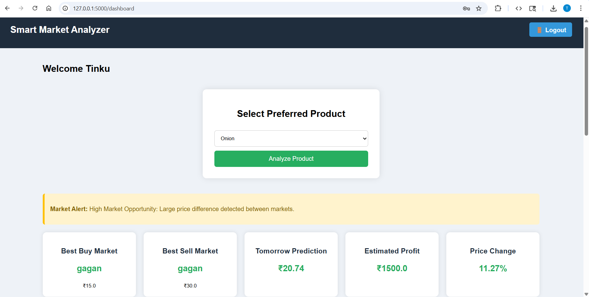
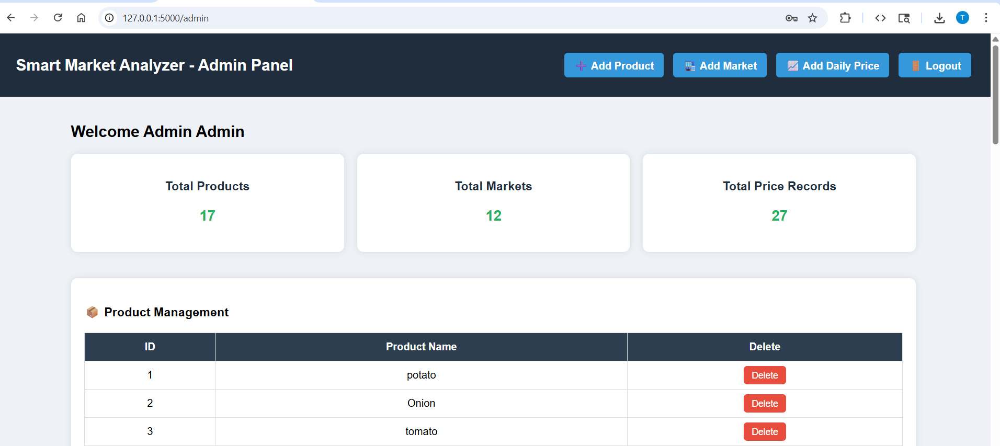

# Smart Market Price Analyzer

> **Intelligent Agricultural Market Monitoring & Recommendation Platform**

A Flask-based web application that helps farmers, traders, and buyers track daily commodity prices across multiple markets, receive smart buy/sell recommendations, visualize price trends, and get alerts about market opportunities.

---

## Table of Contents

- [Version Comparison: V1 vs V2](#version-comparison-v1-vs-v2)
- [Features](#features)
- [System Architecture](#system-architecture)
- [Workflow](#workflow)
- [Project Structure](#project-structure)
- [Database Schema](#database-schema)
- [API Routes](#api-routes)
- [Installation & Setup](#installation--setup)
- [Screenshots](#screenshots)

---

## Version Comparison: V1 vs V2

The core application logic, source code, templates, and database schema are **identical** across both versions. V2 is a **release-ready packaging update** — no functional changes were made.

| Aspect | V1 (Initial Release) | V2 (Release-Ready) |
|---|---|---|
| **Source Code** (`app.py`, all modules) | ✅ Present | ✅ Identical — no changes |
| **Templates** (HTML pages) | ✅ Present | ✅ Identical — no changes |
| **Stylesheet** (`static/css/style.css`) | ✅ Present | ✅ Identical — no changes |
| **Database** (`database.db`) | ✅ Present | ✅ Same file |
| **Requirements** (`requirements.txt`) | ✅ Present | ✅ Identical |
| **`.gitignore`** | ❌ Not included | ✅ Added |
| **`screenshots/` folder** | ❌ Not included | ✅ Added (3 screenshots) |
| **Total files** | 42 files | 47 files |
| **Total size** | ~101 KB | ~1.03 MB (screenshots account for the difference) |

### What Changed in V2

#### 1.`.gitignore` Added
V2 introduces a `.gitignore` to make the project Git-friendly and prevent committing build artifacts:

```
__pycache__/
*.pyc
database.db
static/charts/
.vscode/
.idea/
```

This excludes compiled Python bytecode, the SQLite database (which should be environment-specific), generated chart images, and IDE config folders.

#### 2. `screenshots/` Folder Added
V2 ships three UI screenshots for documentation and README previews:

| File | Description |
|---|---|
| `screenshots/homepage.png` | Landing page with feature highlights (782 KB) |
| `screenshots/dashboard.png` | User dashboard showing analytics cards and price trend chart |
| `screenshots/admin.png` | Admin panel showing product, market, and price management tables |

### Summary

V2 is a **documentation and repository hygiene update**. If you are deploying the application, both versions behave identically. If you are publishing to GitHub or sharing the project, use **V2**.

---

## Features

- **Role-Based Access Control** — Separate Admin and User roles with session-based authentication
- **Daily Price Tracking** — Record commodity prices across multiple markets per day
- **Best Buy / Best Sell Recommendation** — Automatically identifies the cheapest market to buy from and the most profitable market to sell at, factoring in distance
- **Price Trend Chart** — Auto-generated Matplotlib line chart showing average price over time
- **Tomorrow's Price Prediction** — Rule-based forecast: projects the next day's price as 5% above the current average
- **Profit Estimation** — Calculates potential profit margin as `(max_price − min_price) × 100`
- **Market Alerts** — Generates contextual alerts based on price spread and absolute price thresholds
- **User Preferences** — Each user can pin a preferred product for a personalized dashboard view
- **Admin Panel** — Full CRUD management for products, markets, and daily price records

---

## System Architecture



### Layer Breakdown

| Layer | Component | Responsibility |
|---|---|---|
| **Presentation** | Jinja2 Templates + CSS | Renders HTML pages; styled via `static/css/style.css` |
| **Routing** | `app.py` | Defines all URL endpoints, handles sessions, orchestrates module calls |
| **Auth Module** | `modules/auth.py` | Registers new users, validates login credentials against SQLite |
| **Admin Module** | `modules/admin.py` | CRUD for products, markets, and daily price records |
| **Analysis Module** | `modules/analysis.py` | Fetches price data, computes best buy/sell markets, calculates % change |
| **Prediction Module** | `modules/prediction.py` | Generates the Matplotlib price trend chart, predicts tomorrow's price, estimates profit |
| **Alerts Module** | `modules/alerts.py` | Applies rule-based logic to flag high-opportunity or high-price conditions |
| **User Pref Module** | `modules/user_pref.py` | Saves and retrieves each user's preferred product |
| **DB Config** | `modules/db_config.py` | Manages SQLite connection, row factory, and table initialization |
| **Storage** | `database.db` (SQLite) | Persists all application data |
| **Static Assets** | `static/charts/`, `static/css/` | Stores generated charts and stylesheets |

---

## Workflow

### Authentication Workflow



###  Admin Workflow




###  User Dashboard Workflow

```mermaid
flowchart TD
    UserLogin(["User logs in"]) --> Pref{"Preferred product\nset?"}

    Pref -- "No" --> SelectProd["Select product\nfrom dropdown"]
    SelectProd -- "POST /save_preference" --> SavePref[("users.preferred_product")]
    SavePref --> Pipeline

    Pref -- "Yes" --> Pipeline

    subgraph Pipeline["⚙️ Analysis Pipeline"]
        direction TB
        S1["1️⃣  get_all_prices(product_id)\nFetch all price records"]
        S2["2️⃣  get_best_buy_sell(product_id)\nBest Buy = lowest price + nearest market\nBest Sell = highest price market"]
        S3["3️⃣  calculate_percentage_change(product_id)\nformula: ((avg − (avg−2)) ÷ (avg−2)) × 100"]
        S4["4️⃣  generate_price_chart(product_id)\nGROUP BY date → AVG price → Matplotlib PNG"]
        S5["5️⃣  predict_tomorrow_price(product_id)\npredicted = AVG(price) × 1.05"]
        S6["6️⃣  calculate_profit_estimation(product_id)\nprofit = (MAX − MIN) × 100"]
        S7["7️⃣  generate_alerts(product_id)\n(max−min) ≥ 10 → High Opportunity\nmax > 25 → Price Alert\nelse → Market Stable"]
        S1 --> S2 --> S3 --> S4 --> S5 --> S6 --> S7
    end

    Pipeline --> Dashboard[" Dashboard Rendered"]

    subgraph Dashboard["Dashboard Cards"]
        direction LR
        C1[" Best Buy\nMarket & Price"]
        C2[" Best Sell\nMarket & Price"]
        C3[" Tomorrow's\nPredicted Price"]
        C4[" Estimated\nProfit"]
        C5[" Price\nChange %"]
        C6[" Market\nAlert"]
        C7[" Price Trend\nChart"]
        C8[" Full Price\nRecords Table"]
    end
```



---

###  End-to-End Data Flow



---

## Project Structure

```
smart_market_price_analyzer/
│
├── app.py                          # Main Flask app — all routes
│
├── modules/
│   ├── auth.py                     # register_user, login_user
│   ├── admin.py                    # CRUD: products, markets, daily prices
│   ├── analysis.py                 # Price queries, best buy/sell, % change
│   ├── prediction.py               # Chart generation, price prediction, profit
│   ├── alerts.py                   # Rule-based market alert messages
│   ├── user_pref.py                # Save/get user preferred product
│   ├── db_config.py                # SQLite connection + table creation
│   └── recommendation.py           # (Placeholder — not yet implemented)
│
├── templates/
│   ├── index.html                  # Landing / Home page
│   ├── login.html                  # Login form
│   ├── register.html               # Registration form
│   ├── dashboard.html              # User dashboard
│   ├── admin_dashboard.html        # Admin panel
│   ├── add_product.html            # Add product form
│   ├── add_market.html             # Add market form
│   ├── add_price.html              # Add daily price form
│   ├── alerts.html                 # (Placeholder)
│   ├── analysis.html               # (Placeholder)
│   ├── profile.html                # (Placeholder)
│   └── recommendation.html         # (Placeholder)
│
├── static/
│   ├── css/style.css               # Global stylesheet
│   └── charts/price_chart.png      # Auto-generated price trend chart
│
├── sample_data/
│   └── insert_sample_data.py       # Script to seed database with test data
│
├── screenshots/                    # ← V2 ONLY
│   ├── homepage.png
│   ├── dashboard.png
│   └── admin.png
│
├── .gitignore                      # ← V2 ONLY
├── database.db                     # SQLite database
└── requirements.txt                # Python dependencies
```

---

## Database Schema

```sql
-- Users table
CREATE TABLE users (
    id               INTEGER PRIMARY KEY AUTOINCREMENT,
    fullname         TEXT,
    email            TEXT UNIQUE,
    password         TEXT,
    role             TEXT DEFAULT 'user',
    preferred_product INTEGER DEFAULT NULL
);

-- Products table
CREATE TABLE products (
    id           INTEGER PRIMARY KEY AUTOINCREMENT,
    product_name TEXT
);

-- Markets table
CREATE TABLE markets (
    id          INTEGER PRIMARY KEY AUTOINCREMENT,
    market_name TEXT,
    location    TEXT,
    distance    REAL          -- Distance in KM from user's base location
);

-- Daily prices table
CREATE TABLE daily_prices (
    id         INTEGER PRIMARY KEY AUTOINCREMENT,
    product_id INTEGER,       -- FK → products.id
    market_id  INTEGER,       -- FK → markets.id
    price      REAL,
    price_date TEXT           -- Format: YYYY-MM-DD
);
```

---

## API Routes

| Method | Route | Access | Description |
|---|---|---|---|
| GET | `/` | Public | Landing / home page |
| GET | `/register` | Public | Registration page |
| POST | `/register_user` | Public | Create new user account |
| GET | `/login` | Public | Login page |
| POST | `/login_user` | Public | Authenticate and create session |
| GET | `/logout` | Any | Clear session and redirect to login |
| GET | `/dashboard` | User | User analytics dashboard |
| POST | `/save_preference` | User | Save user's preferred product |
| GET | `/admin` | Admin | Admin management dashboard |
| GET | `/add_product` | Admin | Add product form |
| POST | `/save_product` | Admin | Save new product to DB |
| GET | `/add_market` | Admin | Add market form |
| POST | `/save_market` | Admin | Save new market to DB |
| GET | `/add_price` | Admin | Add daily price form |
| POST | `/save_price` | Admin | Save new price record |
| GET | `/delete_product/<id>` | Admin | Delete a product |
| GET | `/delete_market/<id>` | Admin | Delete a market |
| GET | `/delete_price/<id>` | Admin | Delete a price record |

---

## Installation & Setup

### Prerequisites

- Python 3.10+
- pip

### Steps

```bash
# 1. Clone or extract the project
cd smart_market_price_analyzer

# 2. (Optional) Create a virtual environment
python -m venv venv
source venv/bin/activate        # Linux/macOS
venv\Scripts\activate           # Windows

# 3. Install dependencies
pip install -r requirements.txt

# 4. (Optional) Seed sample data
python sample_data/insert_sample_data.py

# 5. Run the application
python app.py
```

The app will start at **http://127.0.0.1:5000**

### Default Roles

To create an admin user, manually update the role column in the database after registration:

```sql
UPDATE users SET role = 'admin' WHERE email = 'your@email.com';
```

### Dependencies

| Package | Purpose |
|---|---|
| `Flask` | Web framework |
| `Flask-Session` | Server-side session management |
| `Werkzeug` | WSGI utilities (used by Flask) |
| `matplotlib` | Price trend chart generation |
| `pandas` | Data manipulation (available for analysis extensions) |
| `numpy` | Numerical operations |

---

## Screenshots

> Screenshots are included in **V2 only** (`screenshots/` folder).

### 🏠 Homepage



---

### 📊 User Dashboard



---

###  Admin Panel



---

## Known Limitations & Future Improvements

| Area | Current State | Suggested Improvement |
|---|---|---|
| **Password Security** | Stored as plain text | Use `werkzeug.security.generate_password_hash` |
| **Price Prediction** | Simple `avg × 1.05` rule | Implement linear regression or time-series (ARIMA) |
| **% Change Calculation** | Uses `avg - 2` as simulated yesterday | Store and query actual previous-day data |
| **Recommendation module** | Empty placeholder file | Build market scoring based on price + distance |
| **Alerts module** | Hardcoded thresholds (10, 25) | Make thresholds configurable per product |
| **Chart** | Single static PNG, no interactivity | Use Plotly or Chart.js for interactive charts |
| **Auth** | No CSRF protection | Add `flask-wtf` for form token validation |
| **Multi-user chart** | All users share one chart file | Generate per-user or per-product chart files |
